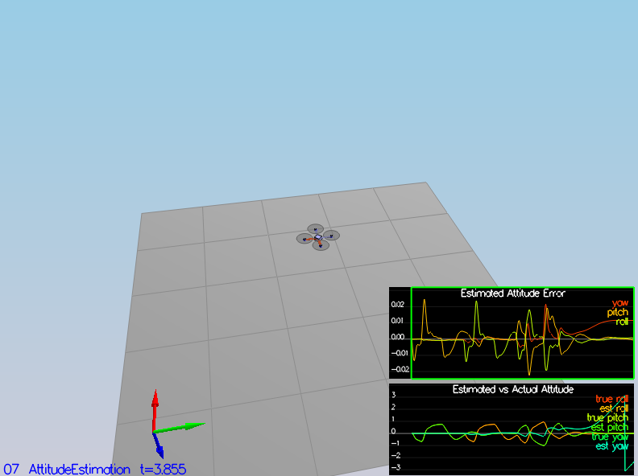

06_SensorNoise
------

I ran the scenario and copied data from Graph1.txt and Graph2.txt in to Excel sheet and found STDEV for both datasets. 
I updated the 06_SensorNoise.txt to calculated values (rounded to single decimal so they match settings.

07_AttitudeEstimation
------
I used recommended Quaternion class methods to convert Euler angels to Quaternion and to integrate body rates to get 
the predicted attitude.

08_PredictState
------
With method Quaternion.Rotate_BtoI I found accelerations in inertial frame from body frame accelerometer readings.
With that I integrated current speed to get predicted position and acceleration to find predicted speed.
Z acceleration needed to be subtracted by gravity.

09_PredictCovariance
-------
First I needed to create an RbgPrime matrix which is used in transition function gPrime. This was done in `GetRbgPrime` 
function with inputs roll, pitch and yaw.

Second step was to create a gPrime matrix and calculate predicted covariance.
Step 3 was to tune `QPosXYStd` and the `QVelXYStd` parameters and results are shown on image below:

10_MagUpdate
-----
Firstly I tuned `QYawStd` to value .02 to capture the drift.

Then implemented `UpdateFromMag` method and normalized the error between measured and estimated yaw to be in -pi:pi range.